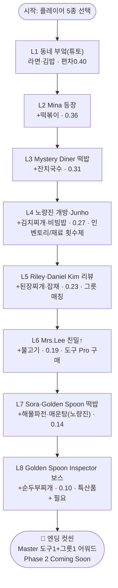

# Unlock Tree — Phase 1 (L1~8)

> L1~8 단계별 해제. 풀 12레벨 = `docs/phase2_archive/unlock-tree-v1.md`. 다인·명품·Master 풀 트리는 Phase 2.

## 1. 레벨 그래프

## 2. 레벨별 해제 상세
| Lv | 손님(편차) | 메뉴 해제 | 시장/재료 | 시스템 신규 | 그릇/도구 |
|---|---|---|---|---|---|
| L1 | (튜토) Mr.Jeong | 라면·김밥 | 동네·Basic | 코어 루프(자동통과) | Basic 그릇/도구 |
| L2 | Mina (0.36) | 떡볶이 | 동네 | 친구 등장 | — |
| L3 | + Mystery Diner (0.31) | 잔치국수 | 동네 | 평가자 떡밥 | — |
| L4 | Junho (0.27) | 김치찌개·비빔밥 | **노량진 개방**·특산품 | **인벤토리·재료 횟수제** | 돌솥(Pro) 가능 |
| L5 | Riley + Daniel Kim리뷰 (0.23) | 된장찌개·잡채 | 특산품(노량진 멸치) | **그릇 매칭 ON** | 백자(Pro) |
| L6 | Mrs.Lee (0.19) | 불고기 | 정육(동네) | **도구 Pro 구매 ON** | Pro 도구 |
| L7 | Sora (0.14) | 해물파전·매운탕 | **노량진 해산물** | Golden Spoon 떡밥 | — |
| L8 | **Golden Spoon Inspector (0.10)** | 순두부찌개 | 특산품+ 필요 | **엔딩 보스** | 어워드: Master 도구1+그릇1 |
> 단계 내 부분 선택 가능(메뉴 순서 자유), 다음 레벨 게이트 = 해당 레벨 손님 θ_pass 만족. 재료 티어: Basic(시작)→특산품(L4~, 평판 단골).

## 3. 엔딩 (L8)
Golden Spoon Inspector θ0.88 만족 → 엔딩 컷씬("당신의 한식, Golden Spoon을 받을 만하군요") + **Master 도구 1 + Master 그릇 1**(상징) + **"Phase 2: 전국 시장·궁중요리·디너 파티 Coming Soon"** 예고.

## 4. Phase 2 미룸(archive)
시장 3~10·메뉴 13~41·명품(3티어)·Master 풀 어워드 트리·다인 디너·L9~12 평가자·DLC·"한식 명인" 메타 트로피.
