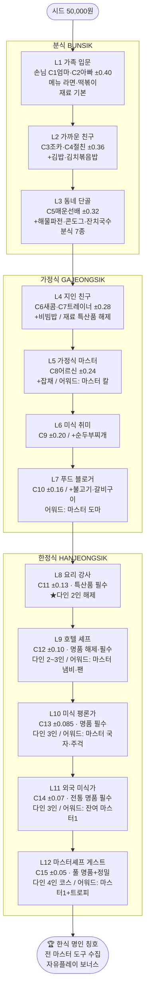

# Unlock Tree v1 — 12단계 해제 그래프 (메뉴·재료·친구·도구·다인)

> 분식 → 가정식 → 한정식 3분기를 12레벨로 세분. 각 레벨은 (a) 손님(캐릭터), (b) 메뉴/재료 티어, (c) 도구 어워드, (d) 다인 모드를 함께 해제. 완전 선형도 완전 자유도 아닌 **단계 내 부분 선택**.
> 연동: `characters-v2.md`(레벨↔캐릭터), `scoring-v2.md`(θ·티어 게이트), `economy-balance-v1.md`(재료·도구 가격/어워드).

## 1. 진행 규칙
- **레벨 게이트 통과** = 해당 레벨 손님을 θ_pass 이상 만족(다인은 All-pass).
- 단계(분식/가정식/한정식) 안에서는 **메뉴 부분 선택 가능**(예: 분식 7종 중 순서 자유), 단 **N종 마스터(3★ 또는 누적 만족)** 가 다음 레벨 게이트.
- 재료 티어는 레벨 도달 + 자금으로 해제(특산품 L4~, 명품 L9~).
- 도구 마스터는 **레벨 클리어 어워드**(구매 불가).

## 2. 12단계 해제 그래프

## 2.5 평가자 떡밥 등장 곡선 ★ (장기 동기)
평가자는 **초중반부터** 명명 캐릭터로 등장(서사 이벤트). 골든스푼은 L3 떡밥 → L10 회수.
| 레벨 | 평가자 | 등장 연출 | 통과 효과 |
|---|---|---|---|
| **L3** | 수상한 평가단(정체불명) | 조용히 별점만 매기고 감 | 신비감(보상 "??? 별") |
| **L5** | 동네 블로거 미나 | 인스타 한 컷 | 만족 시 "동네 추천" = 다음 레벨 보상 +보너스 |
| **L7** | 푸드 유튜버 도연 | 영상 촬영 컷씬 | SNS 효과 → 신규 친구 등장 트리거 |
| **L10** | 골든스푼 평가관(=L3 정체 reveal) | reveal 컷씬 | 골든스푼 엔드게임 관문 개시(명품·마스터도구·매칭그릇 필수) |
| L12 | 마스터 셰프 게스트 | 최종 코스 | 메인 클리어 |
> 캐릭터 상세 `characters-v2 §평가자`. 평가자 등장은 레벨 게이트와 **병행**(해당 레벨 도달 시 narrative event).

## 2.6 시장 개방 곡선 + 평판 (허브 월드)
시장은 레벨 진행에 따라 개방, 각 시장은 **평판**으로 재료 티어·할인·이벤트를 추가 해제(`markets-v1`).
| 레벨 | 개방 시장 | 서사 |
|---|---|---|
| 시작 | 동네 시장(M1) | 동네 부엌 |
| L5 | 가락동 청과(M2) | 시장의 발견 ① |
| L6 | 노량진 수산(M3) | 시장의 발견 ② |
| L7 | 경동시장(M4) | 입소문 ① |
| L8 | 광장시장(M5) | 입소문 ② |
| L9 | 남대문 도매(M6) — 명품 장 입점 | 한식 깊이로 ① |
| L11~12 | 지역(전주 M7·부산 M8·안동 M9) | 한식 명인 |
| DLC | 통인(M10) 등 | 길거리 음식 등 |

**시장 평판(시장별 누적)** — 그 시장 재료로 만든 요리가 호평받을수록 ↑:
| 단계 | 명칭 | 효과 |
|---|---|---|
| 0 | 뜨내기 | 정가, 기본만 |
| 1 | 안면 텄음 | −5%, 제철 정보 |
| 2 | 단골 | −10%, 특산품 해제, 이벤트 알림 |
| 3 | VIP 단골 | −15%, 명품 우선 입수, 새벽 경매 우선 |
> 재료 티어 해제는 **레벨 + 시장 평판** 이중 게이트. 예: 명품 장(순창 고추장)은 남대문 도매(L9 개방) + 평판 2~3단계. 수치 `economy §시장`.

## 3. 레벨별 해제 상세표 (메뉴·재료·도구·그릇·다인·평가자)
| Lv | 손님(편차) | 메뉴 해제 | 재료 티어 | 도구 어워드 | **그릇 어워드** | 다인 |
|---|---|---|---|---|---|---|
| L1 | C1·C2 (0.40) | 라면, 떡볶이 | 기본 | — | — | 1 |
| L2 | C3·C4 (0.36) | 김밥, 김치볶음밥 | 기본 | — | — | 1 |
| L3 | C5 (0.32) | 해물파전, 콘도그, 잔치국수 | 기본 | — | — | 1 |
| L4 | C6·C7 (0.28) | 비빔밥 | **특산품 해제** | — | **옹기** | 1 |
| L5 | C8 (0.24) | 잡채 | 특산품 | **마스터 칼** | — | 1 |
| L6 | C9 (0.20) | 순두부찌개 | 특산품 | — | **백자** | 1 |
| L7 | C10 (0.16) | 불고기, 갈비구이 | 특산품 | **마스터 도마** | — | 1 |
| L8 | C11 (0.13) | (한정식 코스 조합) | **특산품 필수** | — | **돌솥** | **2** |
| L9 | C12 (0.10) | (코스 확장) | **명품 해제·필수** | **마스터 냄비/팬** | **유리 디너웨어** | 2~3 |
| L10 | C13 (0.085) | (코스) | 명품 필수 | **마스터 국자/주걱** | — | 3 |
| L11 | C14 (0.07) | (코스) | **전통 명품 필수** | 잔여 마스터 1 | **유기(놋그릇)** | 3 |
| L12 | C15 (0.05) | (4인 코스) | 풀 명품 | 마스터 1 + 🏆트로피 | **명품 도자기** | 4 |
> 그릇 어워드는 도구와 동급(구매 불가, 레벨 클리어 보상). 구매 가능 그릇(나무소반·모던 플레이트)은 자금으로 별도 획득. 통합 진열 = 트로피 룸(`GDD §8.5`).

> 재료 노드 횟수 표기(횟수제 소모, economy §2): 기본 10~15회/구매 · 중간 4~8 · 특산품 3~5 · 명품 2~3. 재고 0이면 메뉴 잠금 → 재구매.

## 4. 메뉴 ↔ 기존 12음식 매핑 (데이터 보존)
| 단계 | 음식(food_id) |
|---|---|
| 분식 | 라면 t1_002, 떡볶이 t1_003, 김밥 t1_004, 김치볶음밥 t1_005, 해물파전 t1_006, 콘도그 t1_007, 잔치국수 t1_008 |
| 가정식 | 비빔밥 t2_008, 잡채 t2_010, 순두부찌개 t2_013, 불고기 t2_014, 갈비구이 t2_012 |
| 한정식 | (신규 코스 = 기존 음식의 명품 재료 조합 + 다인. 신규 음식 추가는 post-MVP) |
> 기존 12음식 데이터·아트는 그대로 재사용. 한정식은 별도 음식 추가 없이 **명품 재료 + 다인 + 좁은 편차**로 난이도를 구성(디폴트). 신규 한정식 전용 음식은 post-MVP `[사용자 확인 필요]`.

## 5. 다인 모드 해제
- **L8에서 다인(2인) 첫 해제** → L9 2~3인 → L10~11 3인 → L12 4인 코스.
- 다인 게스트 조합은 캐릭터 짝꿍(`characters-v2.md §3`)을 따름.

## 6. 엔드게임 / 메타 (트로피 룸)
- L12 C15(마스터셰프) 4인 코스 All-pass = **메인 클리어** (마스터 도구 + 명품 재료 + 매칭 그릇 3박자).
- **트로피 룸** = 마스터 도구 6종 + 어워드 그릇 6종 진열장(빈 슬롯 실루엣).
- 풀 컬렉션(도구+그릇+🏆트로피) = **"한식 명인" 칭호** → 엔딩 후 자유플레이(보상 +10%, 까다로운 미식가 만족도 보너스 +0.03). 상세 `GDD §8.5`.

## 7. A/B 미결
- **[A/B] 단계 내 자유도**: A=N종 마스터 게이트(디폴트, 부분 선택) / B=완전 자유(아무 때나 다음). 디폴트 A. `[사용자 확인 필요]`
- **[A/B] 한정식 신규 음식**: A=기존 음식 명품화로 대체(디폴트, MVP 경량) / B=한정식 전용 신규 3종 추가(아트·데이터 비용↑). 디폴트 A. `[사용자 확인 필요]`
